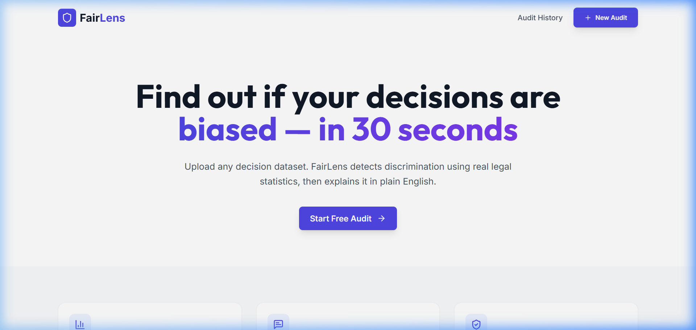
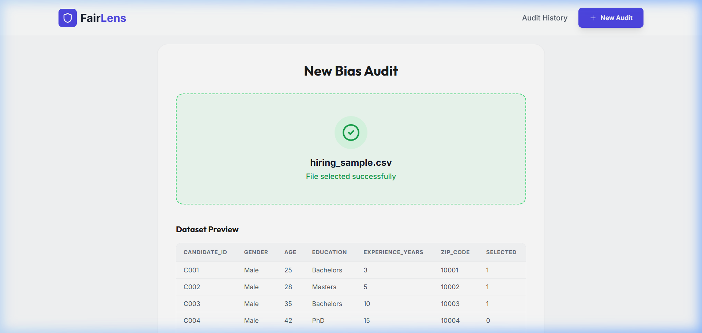
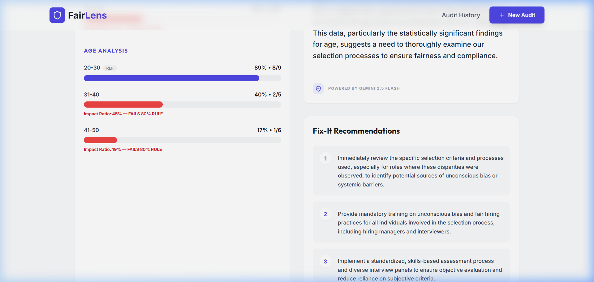
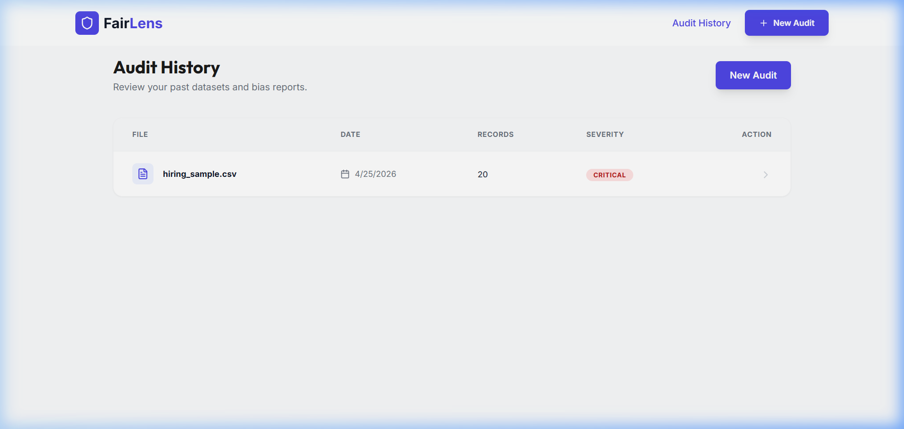

# FairLens — AI-Powered Bias Detection

FairLens is an AI-powered bias detection and audit tool for HR, finance, and healthcare decision datasets.

## Problem
AI systems making hiring, loan, and medical decisions learn from historically biased data — replicating and amplifying discrimination at scale, invisibly.
FairLens makes that invisible bias visible, explainable, and fixable — before it impacts real people.

## Features
- **Statistical Audit**: Uses the EEOC four-fifths rule and Chi-square tests to detect disparate impact.
- **AI Explanations**: Gemini 2.5 Flash explains complex statistics in plain English.
- **Actionable Fixes**: Get 3 specific recommendations to reduce bias.
- **Audit History**: Track all past audits securely in Firebase Firestore.
- **PDF Reports**: Export results as professional PDF summaries.

## Tech Stack
- **Frontend**: React, Tailwind CSS, Framer Motion, Lucide React
- **Backend**: FastAPI, Pandas, Scipy, Gemini 2.5 Flash
- **Database**: Firebase Firestore

## 📸 Screenshots

### 1. Landing Page

*Modern hero section with a clear value proposition.*

### 2. Audit Dashboard

*Intelligent CSV preview and column mapping interface.*

### 3. Bias Analysis Results

*Detailed statistical breakdown with Gemini-powered plain English explanations and actionable recommendations.*

### 4. Audit History

*Secure, isolated history tracking for past audit reports.*

## Setup
1. **Backend**:
   - Install dependencies: `pip install -r requirements.txt`
   - Copy .env.example to .env and add your keys:
       - GEMINI_API_KEY=your_key_here
       - FIREBASE_KEY_PATH=path_to_json_file_with_credentials
   - Run: `python main.py`
2. **Frontend**:
   - Install dependencies: `npm install`
   - Run: `npm run dev`

## Usage
1. Go to `http://localhost:5173`.
2. Click "Start Free Audit".
3. Upload a CSV or use one of the "Try Sample Data" buttons.
4. Select the decision column and demographic columns.
5. Click "Run Bias Audit" and wait for the results.

## 🚀 Deployment
- Frontend: Firebase Hosting
- Backend: Google Cloud Run
- Database: Firebase Firestore
- AI: Gemini 2.5 Flash (Google AI)

## 🔗 Live Demo
👉 https://gdg-fairlens.web.app

## 🎥 Demo Video
👉 [https://youtu.be/U6gAFo4yzN4?si=vOCmR-TjkS8aCD-W](https://youtu.be/ZTHH02KNSbg?si=yJ_UroSzm99ZtqkF)

## 👥 Team
Built for GDG Solution Challenge 2026 - Team Alden
- Archanaa Kumar
- B. Venkata Jayani
- E. Mirza
- T. S. Sabarish
